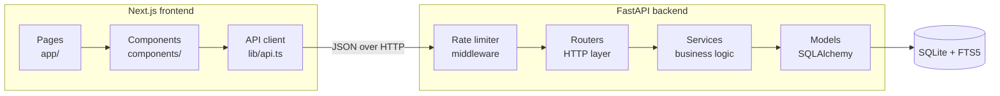
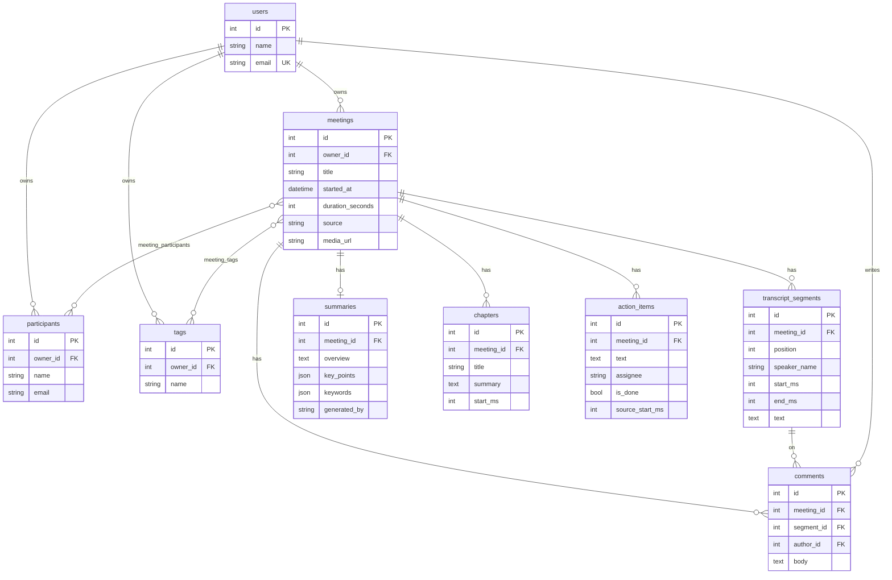
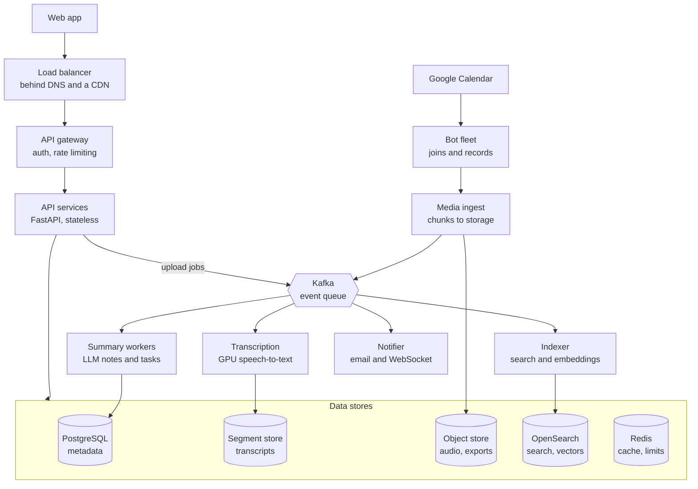

# fireflies.ai_clone

A clone of the Fireflies.ai meeting-assistant web app, built as an assignment: a meetings library, an interactive transcript synced to a player, AI notes with action items, and search across every meeting.

This is an independent practice project and is not affiliated with Fireflies.ai. The app shows its own name, MeetNotes, and its own logo.

Built for the SDE Fullstack assignment with **Next.js (TypeScript)**, **FastAPI** and **SQLite**.

- **Live demo:** _add the deployed frontend URL here_
- **API docs:** _add the deployed backend URL here_ `/docs`

## Contents

1. [Features](#features)
2. [Tech stack](#tech-stack)
3. [Getting started](#getting-started)
4. [Architecture](#architecture)
5. [Database schema](#database-schema)
6. [API overview](#api-overview)
7. [Design decisions and assumptions](#design-decisions-and-assumptions)
8. [Testing](#testing)
9. [Deployment](#deployment)
10. [System design: scaling to 1 million users](#system-design-scaling-to-1-million-users)

## Features

### Core

| Area | What works |
| --- | --- |
| Home | Greeting, assistant cards (latest meeting, open task count), recent meetings, and a capture panel. |
| Meetings library | Meetings grouped by day with title, time, duration, participants, tags and task progress. Search by title, participant or transcript text. Filter by participant, tag and date range. Sort by newest, oldest, title or duration. Pagination. |
| Meeting page | Notes on the left, transcript and chat on the right, player along the bottom. Clicking a transcript line seeks the player, and moving the player scrolls the transcript to the line being spoken. The player has a seek bar, 15-second skip, speed control, a speaker timeline and chapter markers. |
| Transcript search | Highlights every match, shows "2 of 6", and steps through matches with Enter or the arrows. |
| AI notes | Keywords, overview, notes, time-stamped notes and action items, laid out as a document. The overview can be edited; the notes can be condensed, expanded or regenerated from the transcript, copied, and rated. |
| Meeting management | Create a meeting from the Capture menu by pasting a transcript, uploading a `.txt`, `.vtt` or `.json` file, or entering details only. Edit the title, participants and tags. Delete with confirmation. |
| Action items | Add, edit, complete, reassign and delete. Each generated task links to the moment it was said. A Tasks page lists them across every meeting. |
| Experience | Grouped, collapsible sidebar; top bar with search, capture menu and account menu; modals; toasts for every action; empty and error states; settings with sections; responsive down to phone width. |

### Bonus

- **Smart search:** filter the transcript to tasks, questions, dates and times, or metrics, or to one speaker, with talk time per speaker
- Comments on transcript lines, with a thread view
- Export of the transcript or summary as Markdown or plain text
- Global search across all meetings, with highlighted snippets that open the meeting at that moment
- Tags, with filtering
- "Ask this meeting": answers a question with the most relevant transcript lines
- Uploads page with drag and drop, a meeting status page, and an analytics page
- Dark mode

### Placeholders ("Coming soon")

Live call bot, speech-to-text, calendar sync, integrations, team sharing and sign-in. Each is visible in the UI and marked as coming soon. The app assumes one default signed-in user.

## Tech stack

| Layer | Choice |
| --- | --- |
| Frontend | Next.js 15 (App Router), React 19, TypeScript, Tailwind CSS 4, lucide-react icons |
| Backend | Python 3.11+, FastAPI, SQLAlchemy 2, Pydantic 2 |
| Database | SQLite, with the FTS5 extension for full-text search |
| Tests | pytest with FastAPI's test client (30 tests) |

## Getting started

You need Python 3.11 or newer and Node.js 20 or newer.

### 1. Backend

```bash
cd backend
python -m venv .venv
source .venv/bin/activate        # Windows: .venv\Scripts\activate
pip install -r requirements.txt
uvicorn app.main:app --reload --port 8000
```

The first start creates `backend/data/app.db` and seeds six sample meetings. Interactive API docs are at <http://localhost:8000/docs>.

To wipe the database and seed it again:

```bash
python -m app.seed --reset
```

### 2. Frontend

```bash
cd frontend
cp .env.example .env.local       # points the app at http://localhost:8000
npm install
npm run dev
```

Open <http://localhost:3000>.

### Environment variables

| Variable | Where | Default | Purpose |
| --- | --- | --- | --- |
| `NEXT_PUBLIC_API_URL` | frontend | `http://localhost:8000` | Base URL of the backend |
| `DATABASE_URL` | backend | SQLite file at `backend/data/app.db` | Database location |
| `CORS_ORIGINS` | backend | `http://localhost:3000` | Comma-separated origins allowed to call the API |
| `SEED_ON_STARTUP` | backend | `true` | Seed sample meetings when the database is empty |
| `RATE_LIMIT_CAPACITY` | backend | `120` | Burst size of the rate limiter |
| `RATE_LIMIT_REFILL_PER_SECOND` | backend | `2` | Sustained requests per second per client |

## Architecture



The backend has three layers, and each one only talks to the layer below it:

- **Routers** (`app/routers/`) handle HTTP: they validate input with Pydantic schemas, call a service, and choose the status code.
- **Services** (`app/services/`) hold the logic: parsing transcripts, generating notes, searching, exporting and rate limiting. They know nothing about HTTP.
- **Models** (`app/models.py`) define the tables and relationships.

The frontend follows the same idea. Pages own data loading and state, components render and report events, and every network call goes through one typed client in `lib/api.ts`.

### Project structure

```
backend/
  app/
    main.py              App setup, CORS, middleware, router wiring
    config.py            Settings from environment variables
    database.py          Engine, sessions, FTS5 index and triggers
    models.py            Tables and relationships
    schemas.py           Request and response shapes
    deps.py              Current user and "meeting I own" dependencies
    routers/             meetings, transcript, notes, search, export
    services/
      transcript_parser.py   .txt / .vtt / .json to timed segments
      summarizer.py          SummaryProvider interface + extractive provider
      insights.py            Smart filters and talk time per speaker
      search.py              FTS5 queries
      meetings.py            Create, list and filter meetings
      exporter.py            Markdown and text export
      rate_limiter.py        Token-bucket middleware
    seed.py, seed_data.py    Sample meetings
  tests/
frontend/
  app/                   Routes: home, meetings, meetings/[id], tasks, status, uploads,
                         analytics, search, settings, and coming-soon pages
  components/
    layout/              AppShell, Sidebar, Topbar, nav
    meetings/            Library rows, filters, create/edit modal
    meeting/             Player, TranscriptPanel, NotesPanel, SmartSearchPanel,
                         CommentsPanel, ActionItems, AskPanel, MeetingHeader
    ui/                  Button, Modal, Dropdown, Toast, Avatar, Theme, Page, empty states
  lib/                   api.ts, types.ts, format.ts, usePlayback.ts, useMeetings.ts, useDebounce.ts
```

### How player and transcript stay in sync

`usePlayback` (in `frontend/lib/`) is the single source of truth for the current time. The player, the transcript and the outline all read `currentMs` from it and call `seek(ms)` on it.

- **Transcript to player:** clicking a line calls `seek(line.start_ms)`.
- **Player to transcript:** the transcript finds the last line whose `start_ms` is at or before `currentMs`, highlights it, and scrolls it into view.

## Database schema



Notes on the design:

- **Ten tables plus one search index.** `meeting_participants` and `meeting_tags` are join tables for the two many-to-many relationships.
- **Deleting a meeting removes everything under it.** Every child table has `ON DELETE CASCADE`, and SQLite's foreign keys are switched on for each connection.
- **Times are integers in milliseconds** on segments, chapters and tasks, so seeking needs no parsing. Meeting dates are stored as UTC.
- **Uniqueness:** a participant or tag name is unique per owner, so the same person is one row across all their meetings.
- **Indexes:** `(owner_id, started_at)` serves the library page; `(meeting_id, position)` serves reading a transcript in order.
- **Search index:** `segment_fts` is an FTS5 external-content table over `transcript_segments`. Three triggers keep it in step on insert, update and delete, so application code never has to remember to update it.
- **One summary per meeting** is enforced with a unique constraint on `summaries.meeting_id`.

## API overview

All routes are under `/api`. Full request and response shapes are in the generated docs at `/docs`.

| Method | Path | Purpose |
| --- | --- | --- |
| GET | `/meetings` | List meetings. Query: `q`, `participant`, `tag`, `source`, `date_from`, `date_to`, `sort`, `page`, `page_size` |
| POST | `/meetings` | Create from a form, with an optional pasted transcript |
| POST | `/meetings/upload` | Create from an uploaded `.txt`, `.vtt` or `.json` file (multipart) |
| GET | `/meetings/{id}` | Meeting with summary, chapters and action items |
| PATCH | `/meetings/{id}` | Edit title, date, participants, tags |
| DELETE | `/meetings/{id}` | Delete the meeting and everything under it |
| GET | `/meetings/{id}/transcript` | Transcript lines in order; `q` filters to matching lines |
| GET | `/meetings/{id}/insights` | Smart filters (tasks, questions, dates, metrics) and talk time per speaker |
| PATCH | `/meetings/{id}/summary` | Edit the overview or key points, or rate the summary 1 to 5 |
| POST | `/meetings/{id}/summary/regenerate` | Rebuild notes from the transcript. Body: `style` = `condensed`, `standard` or `expanded` |
| GET | `/action-items` | Action items across all meetings. Query: `done` |
| GET, POST | `/meetings/{id}/action-items` | List or add action items |
| PATCH, DELETE | `/action-items/{id}` | Edit, complete or delete an action item |
| GET, POST | `/meetings/{id}/comments` | List or add comments on transcript lines |
| DELETE | `/comments/{id}` | Delete a comment |
| POST | `/meetings/{id}/ask` | Answer a question with the most relevant transcript lines |
| GET | `/meetings/{id}/export` | Download. Query: `content=transcript\|summary`, `format=md\|txt` |
| GET | `/search?q=` | Matching meetings plus ranked, highlighted transcript lines |
| GET | `/participants`, `/tags`, `/me` | Lookup lists for filters, and the current user |
| GET | `/healthz` | Health check (outside `/api`) |

Conventions: `201` on create, `204` on delete, `404` for a missing or unowned resource, `422` for invalid input, `429` with `Retry-After` when rate limited. Errors are JSON with a `detail` message that the UI shows in a toast.

### Transcript formats

```text
# .txt: one line per turn; the timestamp is optional
[00:01:30] Asha: Thanks for joining.
Ben: The build is ready.
```

```text
WEBVTT

00:00:01.000 --> 00:00:04.000
<v Asha>Thanks for joining.
```

```json
[{ "speaker": "Asha", "start": 1.0, "end": 4.0, "text": "Thanks for joining." }]
```

When a transcript has no timestamps, timings are estimated from word count at a normal speaking pace.

## Design decisions and assumptions

- **The player is simulated.** The brief allows a placeholder, and the sample meetings have no audio. `usePlayback` advances a clock on a timer, so play, pause, seek, speed and sync all behave as they would with audio. Because the rest of the UI only sees `currentMs` and `seek`, wiring in a real `<audio>` element later would be contained to that one hook. The `media_url` column is already in the schema for it.
- **Summaries are seeded or extractive, not LLM-written.** Sample meetings ship with hand-written notes. For new transcripts, `ExtractiveSummaryProvider` scores sentences by keyword frequency and picks action items by phrases such as "I'll" and "we need to". It is deterministic and needs no API key, so the demo cannot fail on a missing key or quota. An LLM provider can implement the same `SummaryProvider` interface.
- **Refine rewrites from the transcript.** Condense, Standard and Expand ask the summarizer for 3, 5 or 8 key points. On a sample meeting this replaces the hand-written notes; `python -m app.seed --reset` restores them.
- **Smart filters are rules, not a model.** A line counts as a question if it contains a question mark, as a task if it matches commitment phrases, and so on. The rules are in `app/services/insights.py`.
- **"Ask" is retrieval only.** It returns the transcript lines that best match the question, ranked by BM25. That is the retrieval half of retrieval-augmented generation; an LLM would be handed those same lines to write a fluent answer.
- **One default user.** There is no sign-in, but every table that needs it has an owner and every query filters by it, so adding authentication means changing `get_current_user` and nothing else.
- **Regenerating notes never deletes a user's tasks.** Action items are only generated when a meeting has none.
- **Search input is always quoted** before it reaches FTS5, so characters such as `"` or `*` typed by a user cannot break or alter the query.
- **Search snippets are rendered as text.** The frontend splits on the `<mark>` tags and builds elements itself, so transcript content is never inserted as HTML.
- **Tables are created with `create_all`** on startup, which does not alter existing tables. After pulling a schema change, run `python -m app.seed --reset`. A production system would use versioned migrations (Alembic).
- **The rate limiter keeps its buckets in memory**, which is correct for one server process. With several servers the same algorithm would store buckets in Redis.

## Testing

```bash
cd backend
pytest
```

30 tests cover the transcript parser, meeting CRUD and filters, UTC handling, action items across meetings, summary refine and rating, smart filters, comments, search (including hostile input and index cleanup on delete), ask, export, seeding and the rate limiter. Each test runs against a fresh temporary database.

```bash
cd frontend
npm run lint
npm run build
```

## Deployment

- **Backend (Render or Railway):** root directory `backend`, build `pip install -r requirements.txt`, start `uvicorn app.main:app --host 0.0.0.0 --port $PORT`. Set `CORS_ORIGINS` to the frontend's URL. A `render.yaml` is included.
- **Frontend (Vercel):** root directory `frontend`. Set `NEXT_PUBLIC_API_URL` to the backend's URL.

SQLite is a file on the server's disk. Hosts without a persistent disk reset that file on each deploy or restart; the app then reseeds the sample meetings on startup, so the demo is never empty, but meetings created by visitors are lost. Attach a persistent disk and point `DATABASE_URL` at it to keep them.

---

## System design: scaling to 1 million users

This section describes how the same product would be built for 1 million users with a real meeting bot and real transcription. The code in this repository is the single-server version of it; the [last table](#what-this-repository-implements) maps one to the other.

At that scale the API is small (about 1,200 requests per second at peak). The hard parts are the meeting-bot fleet (about 33,000 concurrent bots) and the transcription pipeline (16 million audio minutes a day).

### Functional requirements

**Capture**

- Sign in with Google and connect a calendar.
- A bot joins Google Meet calls, either invited by email or auto-joined from the calendar.
- Paste a meeting link to send the bot on demand.
- Upload an audio, video or transcript file.

**Process**

- Transcribe audio with speaker labels and timestamps.
- Generate a summary, action items and chapters for each meeting.

**Consume**

- Browse the meetings library with search, filters and sorting.
- Open a meeting with player and transcript in sync, and search inside the transcript.
- Search across all meetings.
- Ask a question about a meeting and get an answer grounded in its transcript.
- Create, edit and delete meetings; add, edit and complete action items.
- Comment on transcript lines; tag meetings; export transcripts and summaries.
- Share a meeting by link or with a team workspace.
- Get notified by email and in-app when notes are ready.

**Out of scope:** live transcription during the call, Zoom and Teams bots, CRM sync, billing.

### Non-functional requirements

| Area | Target |
| --- | --- |
| API availability | 99.9% a month (about 43 minutes of downtime) |
| Read latency | p95 under 200 ms for library and meeting pages |
| Search latency | p95 under 500 ms |
| Bot join | 99% of scheduled meetings joined within 60 seconds of start |
| Notes ready | p95 within 10 minutes of the meeting ending |
| Durability | No recording or transcript lost once the upload is acknowledged |
| Consistency | Strong for meeting metadata and action items; eventual for search and analytics |
| Scalability | Horizontal scaling with no single point of failure |
| Security | TLS in transit, encryption at rest, encrypted OAuth tokens, strict tenant isolation |
| Privacy | Bot announces recording; users can delete a meeting and all derived data |
| Observability | Metrics, structured logs and traces for every pipeline stage |

### Capacity estimation

Every figure follows from the assumptions in the first table. They are planning assumptions, not measurements; change them and the rest scales with them.

**Assumptions**

| Input | Value |
| --- | --- |
| Registered users | 1,000,000 |
| Daily active users | 200,000 (20%) |
| Meetings recorded per active user per day | 2 |
| Average meeting length | 40 minutes |
| API requests per active user per day | 100 |
| Read to write ratio | About 20 to 1 |
| Peak to average factor | 5x for API traffic, 3x for concurrent meetings |
| Audio bitrate stored | 32 kbps (audio only) |

**Traffic**

| Metric | Calculation | Result |
| --- | --- | --- |
| Meetings per day | 200,000 x 2 | 400,000 |
| API requests per day | 200,000 x 100 | 20 million |
| Average API rate | 20 million / 86,400 s | About 230 per second |
| Peak API rate | 230 x 5 | About 1,200 per second |
| Search queries per day | 200,000 x 5 | 1 million (about 60 per second at peak) |

**Meetings and bots**

| Metric | Calculation | Result |
| --- | --- | --- |
| Audio minutes per day | 400,000 x 40 | 16 million |
| Average concurrent meetings | 16 million / 1,440 min | About 11,000 |
| Peak concurrent bots | 11,000 x 3 | About 33,000 |
| Bot compute at peak | 1 vCPU and 2 GB per bot | About 33,000 vCPUs, 66 TB of RAM |
| Ingest bandwidth at peak | 33,000 x 32 kbps | About 1 Gbps |

Meetings start on the hour and half hour, so bot joins arrive in bursts of thousands within a minute or two. The fleet must be warmed up ahead of those marks.

**Storage**

| Data | Per meeting | Per day | Per year |
| --- | --- | --- | --- |
| Audio (32 kbps x 2,400 s) | 9.6 MB | 3.84 TB | About 1.4 PB |
| Transcript (about 6,000 words, 300 segments) | 60 KB | 24 GB | About 8.8 TB |
| Transcript segment rows | 300 | 120 million | About 44 billion |
| Meeting metadata, summary, action items | 5 KB | 2 GB | About 730 GB |

Storing video at about 1 Mbps would be 300 MB per meeting, or 120 TB a day. Audio-only is the default for that reason.

**Processing**

| Metric | Calculation | Result |
| --- | --- | --- |
| Audio hours to transcribe per day | 16 million / 60 | About 267,000 |
| GPUs needed, at 40x real-time | 267,000 / 40 / 24 | About 280 average, 830 at peak |
| LLM input tokens per day | 400,000 x 8,000 | 3.2 billion |
| LLM output tokens per day | 400,000 x 1,000 | 400 million |

Transcription is the largest cost. At an illustrative vendor price of $0.006 per minute it would be about $96,000 a day, which is why self-hosted GPU workers are worth it at this scale. The 40x speed and the price are assumptions to check against the chosen model and vendor.

### High-level design

User requests are answered synchronously by stateless API services. Recordings are processed asynchronously by workers that pull events from a queue.



**Life of a meeting**

1. Calendar sync sees an event with a Meet link and schedules a bot for its start time.
2. The bot joins, announces the recording, and streams audio in 30-second chunks to media ingest, which writes them to the object store.
3. When the meeting ends, media ingest publishes `recording.completed`.
4. Transcription workers produce speaker-labelled segments, write them to the segment store, and publish `transcript.ready`.
5. Summary workers and the indexer consume that event in parallel. Summaries, action items and chapters go to PostgreSQL; text and embeddings go to OpenSearch.
6. The notifier emails the user and pushes an in-app update; the meeting status becomes ready.
7. When the user opens the meeting, the API reads Redis first and falls back to the stores on a miss.

Uploaded files skip steps 1 and 2: the API stores the file and publishes the same `recording.completed` event.

### Database design at scale

No single database fits every workload, so each kind of data goes to the store that suits its access pattern.

| Store | Holds | Partition key | Why this store |
| --- | --- | --- | --- |
| PostgreSQL | Users, workspaces, meetings, participants, summaries, action items, tags, comments, integrations | `workspace_id` | Relational data with transactions and joins |
| Wide-column store (Cassandra or DynamoDB) | Transcript segments | `meeting_id`, sorted by `start_ms` | 44 billion rows a year, always read by meeting in time order |
| Object storage (S3) | Audio, video, raw transcript files, exports | `workspace/meeting/` prefix | Cheap, durable storage for 1.4 PB a year |
| OpenSearch | Transcript text, titles, participants | Routed by `workspace_id` | Full-text search with highlighting |
| Vector index | Embeddings of transcript chunks | `meeting_id` | Retrieval for "ask this meeting" |
| Redis | Cache, rate-limit counters, sessions | Key hash | Sub-millisecond reads |
| Kafka | Pipeline events | `meeting_id` | Ordered, replayable events per meeting |

Scaling PostgreSQL:

- Index `meetings (workspace_id, started_at DESC)` to serve the library page.
- Use one primary with read replicas; send the 20-to-1 read traffic to the replicas.
- Pool connections with PgBouncer.
- Partition `meetings` by month so old partitions can move to cheaper storage.
- Shard by `workspace_id` when one primary is no longer enough. A workspace never spans shards, so queries stay on a single shard.

Data lifecycle: audio moves to a cold storage tier after 90 days. Deleting a meeting removes its rows, segments, search documents, embeddings and media through one delete event.

### Caching

A processed meeting almost never changes, so most reads can be served from cache. The pattern is cache-aside: read the cache, fall back to the database on a miss, then fill the cache.

| Data | Where | TTL | Invalidated when |
| --- | --- | --- | --- |
| Static assets (JS, CSS, images) | CDN | 1 year, hashed filenames | A new build ships |
| Audio and video | CDN, signed URLs | URL valid 1 hour | The meeting is deleted |
| Meeting metadata and summary | Redis | 1 hour | The meeting or summary is edited |
| Transcript document | Redis | 24 hours | A speaker is renamed or text is corrected |
| Library first page, per user | Redis | 60 seconds | A meeting is created or deleted |
| Search results | Redis | 30 seconds | Expires on its own |
| "Ask" answers, by meeting and question hash | Redis | 24 hours | The transcript changes |
| Session and user profile | Redis | 15 minutes | Sign-out or profile edit |

- **Invalidation:** the write path deletes the key after the database commit; the next read refills it.
- **Stampede protection:** add random jitter to TTLs, and let only one request rebuild a missing key while the others wait.
- **Sizing:** 200,000 active users x 3 recent meetings x about 100 KB is about 60 GB, which fits a small Redis cluster with replicas.
- **Eviction:** least-recently-used, so cold meetings drop out first.

### Rate limiting

The limiter is a token bucket per user, stored in Redis and enforced at the API gateway. A token bucket allows short bursts, such as a page load firing several requests, while capping the sustained rate.

| Endpoint group | Limit | Keyed by |
| --- | --- | --- |
| General API | 120 per minute | User |
| Search | 30 per minute | User |
| Ask this meeting | 20 per hour | User |
| File upload | 10 per hour | User |
| Send bot to a link | 10 per hour | User |
| Sign-in | 10 per minute | IP address |

These limits are starting points to tune from real traffic.

- **Atomicity:** one Lua script reads the bucket, refills it and takes a token, so two gateways cannot both spend the same token.
- **Response:** HTTP 429 with a `Retry-After` header, plus `X-RateLimit-Remaining` on every response.
- **Plan quotas:** monthly transcription minutes per workspace are a separate check stored in PostgreSQL, because they must survive a Redis restart.
- **If Redis is down:** cheap endpoints fall back to a per-instance in-memory limiter. Costly endpoints (ask, upload, bot) reject requests until Redis is back.
- **Outbound limits:** workers also throttle their own calls to Google and LLM APIs to stay inside vendor quotas.

### Load balancing

Traffic is balanced at four layers, and API servers hold no session state, so any server can answer any request.

| Layer | What it does | Algorithm |
| --- | --- | --- |
| DNS | Sends users to the nearest healthy region | Latency-based routing with health checks |
| CDN | Serves static files and media from the edge | Nearest edge location |
| Layer 7 load balancer | Terminates TLS, routes by path to API or WebSocket servers | Least outstanding requests |
| Layer 4 load balancer | Carries bot audio streams to ingest servers | Least connections |

- **Health checks:** call `/healthz` every 10 seconds; remove a server after 3 failures and return it after 2 passes.
- **Zones:** servers run in at least three availability zones, so losing one zone removes a third of capacity at most.
- **Deploys:** connection draining lets in-flight requests finish before a server stops.
- **No sticky sessions:** authentication is a signed token checked on every request.
- **WebSockets:** notification servers subscribe to Redis pub/sub, so an event reaches the user whichever server holds their connection.
- **Workers:** they pull from Kafka, so the queue itself spreads the load and no balancer is needed.

### Scalability and reliability

Every component scales horizontally, and the queue between stages means a slow stage delays notes instead of losing them.

| Component | Scales by | When it fails |
| --- | --- | --- |
| API servers | Autoscale on CPU and request rate; about 20 instances at peak | Load balancer removes the instance |
| Bot fleet | One container per meeting, scheduled from the calendar and warmed before :00 and :30 | Bot rejoins within 30 seconds; audio is uploaded in 30-second chunks, so little is lost |
| Transcription workers | Autoscale GPU workers on queue depth | Retry with backoff, then dead-letter queue |
| Summary workers | Autoscale on queue depth, throttled to LLM token limits | Retry, then fall back to a second model |
| PostgreSQL | Read replicas, then shards by workspace | Automatic failover to a standby |
| Segment store | Add nodes; data rebalances | Replication factor 3 |
| OpenSearch | Add shards and nodes | Rebuild the index from the segment store |
| Kafka | Add partitions, keyed by meeting | Replication factor 3 |

- **Idempotent workers:** each job is keyed by meeting and stage, so a retried job overwrites its own output instead of duplicating it.
- **Outbox pattern:** a service writes its database change and its event in one transaction, so an event is never lost between the two.
- **Circuit breakers:** calls to Google and LLM APIs stop for a cool-off period after repeated failures.
- **Graceful degradation:** if summaries are down, the transcript is still served; if search is down, the library still loads.
- **Backpressure:** when the transcription queue grows past a threshold, free-plan jobs wait behind paid ones.

### What this repository implements

| Concern | This repository | At 1 million users |
| --- | --- | --- |
| Database | SQLite (required by the brief) | PostgreSQL plus a wide-column segment store |
| Search | SQLite FTS5 | OpenSearch |
| Background jobs | Notes generated inside the request | Kafka and worker fleets |
| Cache | None needed at this size | Redis and a CDN |
| Rate limiter | In-memory token bucket middleware | Redis token bucket at the gateway |
| Load balancer | The hosting platform's | DNS, CDN, layer 7 and layer 4 |
| Media | Simulated playback, no file | Object storage behind a CDN |
| Summaries | `SummaryProvider` interface with an extractive provider | LLM workers behind the same interface |
| Transcription and bot | Placeholders | GPU workers and a bot fleet |
| Auth | One default user; every query filters by owner | Google sign-in and workspaces |

The swap points are `app/models.py` and `app/database.py` (database), `app/services/search.py` (search), `SummaryProvider` (notes) and `get_current_user` (auth).
